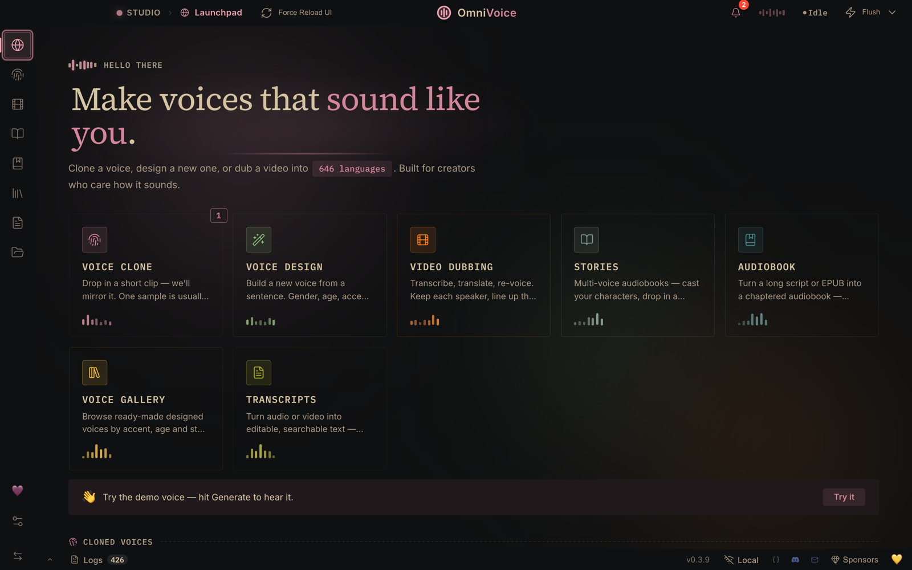
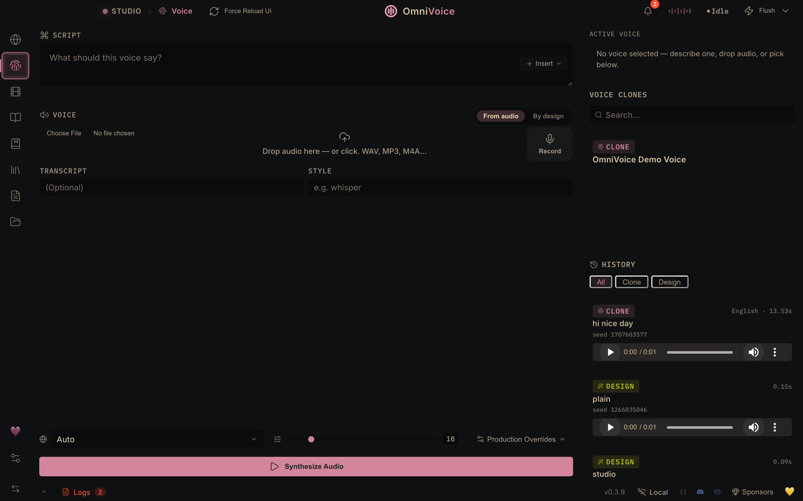
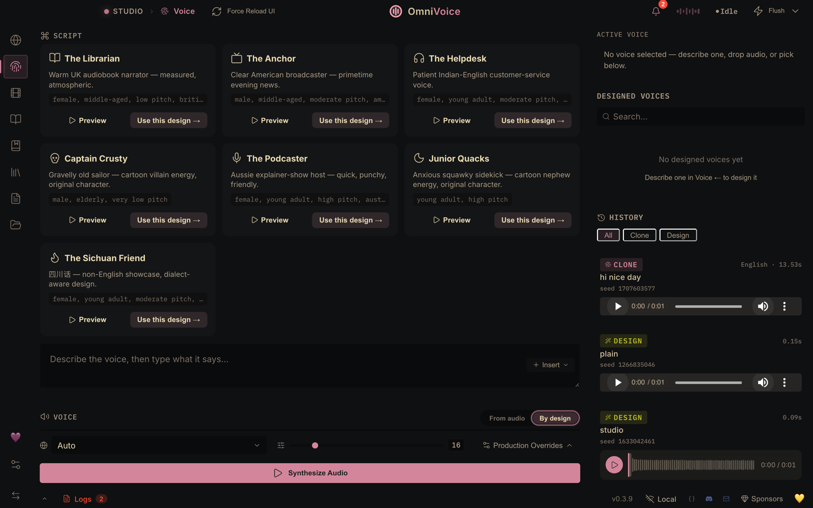
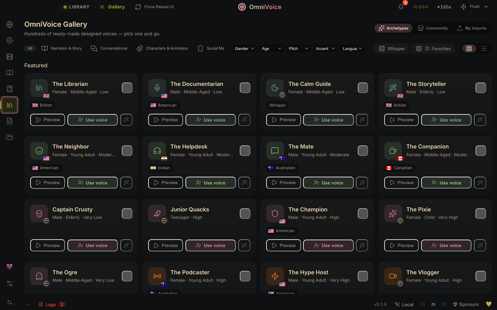
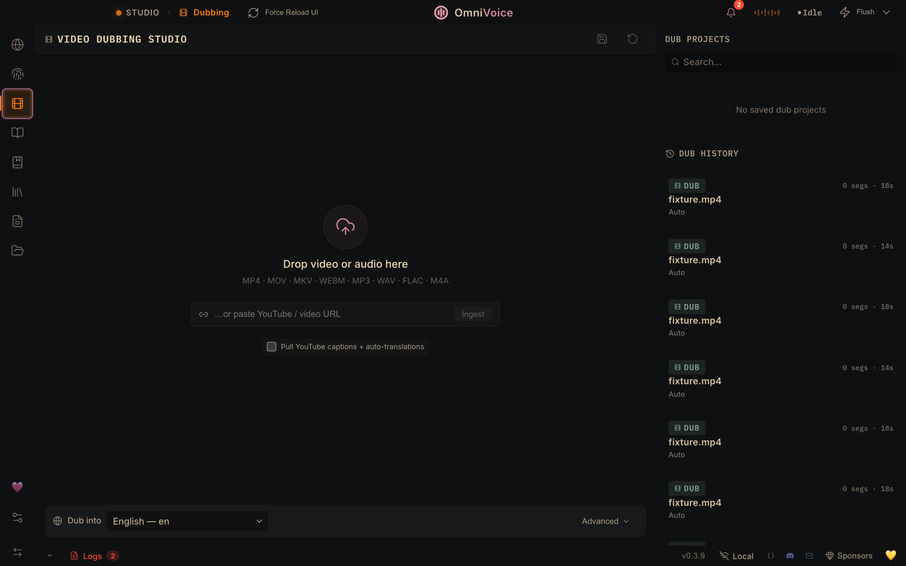
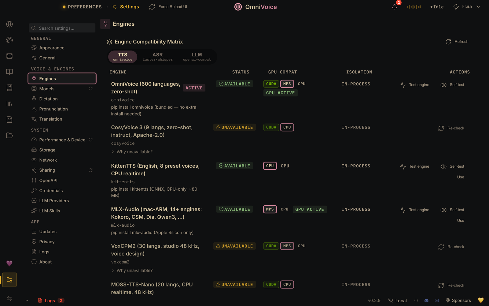
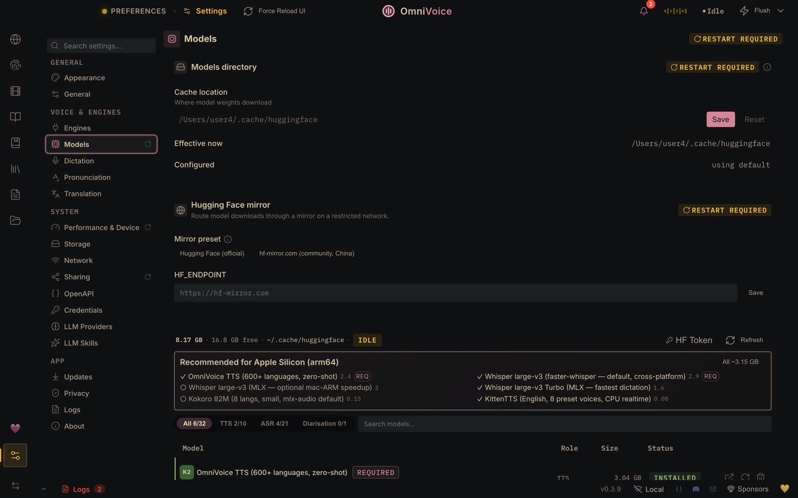
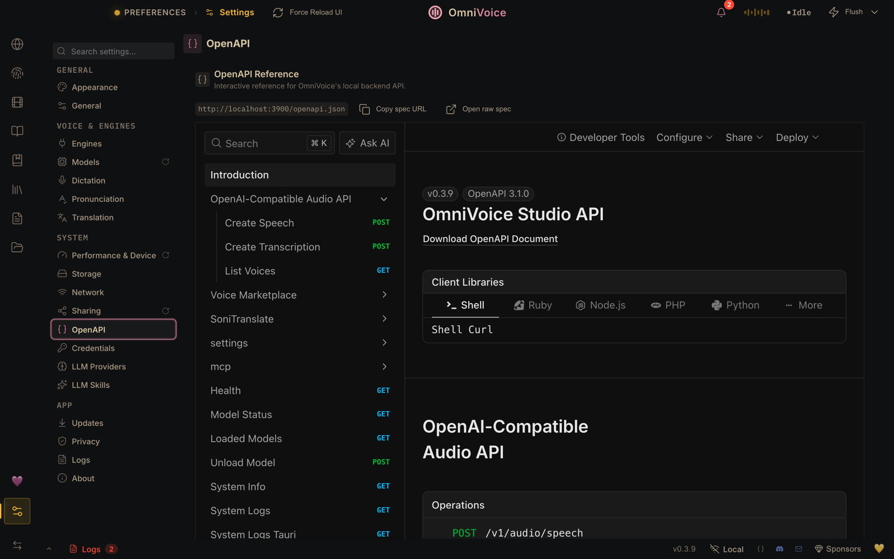
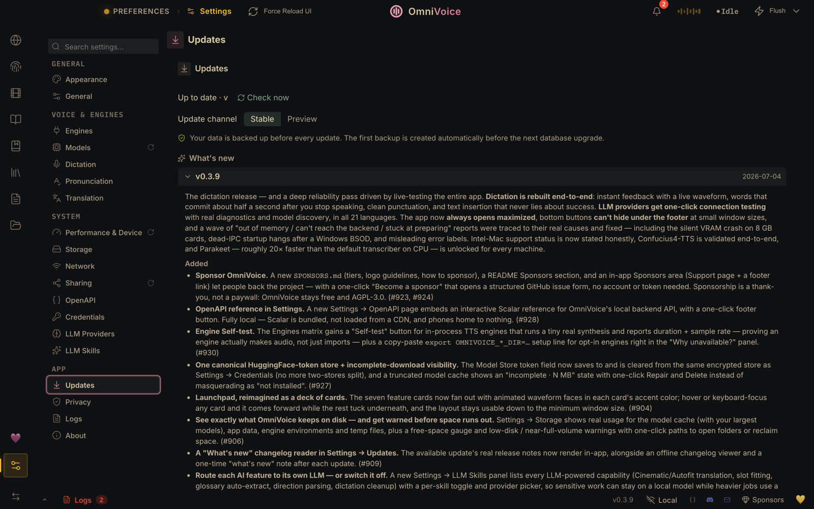

<div align="center">
  
  <h1>OmniVoice Studio</h1>
  <h3>The open-source ElevenLabs alternative.</h3>
  <p>Real-time dictation, zero-shot voice cloning, and cinematic video dubbing — all on your desktop.<br/>Open-source, no API keys, fully local. <b>646 languages.</b></p>

  <p>
    <a href="#quickstart">Quickstart</a> ·
    <a href="#features">Features</a> ·
    <a href="#why-ovs">Why OVS</a> ·
    <a href="#tts-engines">TTS Engines</a> ·
    <a href="#asr-engines">ASR Engines</a> ·
    <a href="#sponsors">Sponsors</a> ·
    <a href="#sponsor--donate">Donate</a> ·
    <a href="#contributing">Contributing</a> ·
    <a href="https://discord.gg/bzQavDfVV9">Discord</a> ·
    <a href="README_CN.md"><strong>简体中文</strong></a>
  </p>

  <p>
    <a href="https://github.com/debpalash/OmniVoice-Studio/stargazers"></a>
    <a href="https://github.com/debpalash/OmniVoice-Studio/releases/latest"></a>
    <a href="LICENSE"></a>
    <a href="https://github.com/debpalash/OmniVoice-Studio/issues"></a>
    <a href="https://discord.gg/bzQavDfVV9"></a>
    <a href="https://ko-fi.com/debpalash"></a>
    <a href="https://paypal.me/palashCoder"></a>
  </p>
</div>

<br/>

<div align="center">
  
</div>

> [!WARNING]
> **OmniVoice Studio is in active beta.** Things may break between releases. For the latest features and fixes, clone the repo and run from source rather than using pre-built installers. Bug reports and PRs are very welcome — [open an issue](https://github.com/debpalash/OmniVoice-Studio/issues) or [join Discord](https://discord.gg/bzQavDfVV9).

<div align="center">
  <br/>
  <a href="https://discord.gg/bzQavDfVV9"></a>
  <br/>
  <sub>Get setup help · Share your dubs · Vote on the roadmap · Early access to new engines</sub>
  <br/>
</div>

<br/>

<a id="features"></a>

## ✨ Features

<table>
<tr>
  <td align="center" width="25%">
    <h3>🎙️ Voice Cloning</h3>
    <p>3-second clip → mirror any voice.<br/><b>646 languages</b>, zero-shot.</p>
  </td>
  <td align="center" width="25%">
    <h3>🎨 Voice Design</h3>
    <p>Gender, age, accent, pitch, speed,<br/>emotion, dialect — <b>dial it in</b>.</p>
  </td>
  <td align="center" width="25%">
    <h3>🎬 Video Dubbing</h3>
    <p>YouTube URL or file → transcribe →<br/>translate → re-voice → <b>MP4</b>.</p>
  </td>
  <td align="center" width="25%">
    <h3>📖 Audiobook Editor</h3>
    <p>Import text, EPUB, or PDF. Auto-chapter,<br/>loudnorm, metadata. Export <b>.m4b</b>.</p>
  </td>
</tr>
<tr>
  <td align="center" valign="top">
    <h3>🎭 Stories</h3>
    <p>Multi-voice editor. Assign voices<br/>per-line, preview, <b>export full cast</b>.</p>
  </td>
  <td align="center" valign="top">
    <h3>⌨️ Dictation Widget</h3>
    <p><kbd>⌘</kbd>+<kbd>⇧</kbd>+<kbd>Space</kbd> from <b>any app</b>.<br/>Transcribes, auto-pastes, disappears.</p>
  </td>
  <td align="center" valign="top">
    <h3>🔊 Vocal Isolation</h3>
    <p>Demucs-powered. Splits speech<br/>from music, <b>keeps the background</b>.</p>
  </td>
  <td align="center" valign="top">
    <h3>👥 Speaker Diarization</h3>
    <p>Pyannote + WhisperX.<br/><b>Auto-identifies</b> who said what.</p>
  </td>
</tr>
<tr>
  <td align="center" valign="top">
    <h3>📦 Batch Queue</h3>
    <p>Drop <b>50 videos</b>, walk away.<br/>Progress bars per job.</p>
  </td>
  <td align="center" valign="top">
    <h3>🤖 MCP Server</h3>
    <p>Use OmniVoice from <b>Claude</b>,<br/>Cursor, or any MCP client.</p>
  </td>
  <td align="center" valign="top">
    <h3>🛡️ AI Watermark</h3>
    <p>AudioSeal (Meta). <b>Invisible</b>,<br/>survives compression.</p>
  </td>
  <td align="center" valign="top">
    <h3>🔬 Diagnostics</h3>
    <p>Self-check, error journal,<br/>scrubbed <b>diagnostic bundle</b>.</p>
  </td>
</tr>
<tr>
  <td align="center" valign="top">
    <h3>🔐 100% Local</h3>
    <p>No keys, no cloud, no accounts.<br/><b>Your machine only</b>.</p>
  </td>
  <td align="center" valign="top">
    <h3>⚡ GPU Auto-Detect</h3>
    <p>CUDA · MPS · ROCm · CPU.<br/>≤8 GB? <b>Auto-offloads</b>.</p>
  </td>
  <td align="center" valign="top">
    <h3>🧩 Extensible</h3>
    <p>Subclass <code>TTSbackend</code>,<br/>add any engine in <b>~50 lines</b>.</p>
  </td>
  <td align="center" valign="top">
    <h3>🧭 Engine Routing</h3>
    <p>Preflight GPU check per engine.<br/><b>No silent CPU fallback</b>.</p>
  </td>
</tr>
<tr>
  <td align="center" valign="top">
    <h3>🎒 Portable Personas</h3>
    <p>Export voices as <code>.ovsvoice</code><br/>bundles — identity + <b>watermark</b>.</p>
  </td>
  <td align="center" valign="top">
    <h3>♾️ Unlimited TTS</h3>
    <p>Sentence-chunked generation.<br/><b>No length cap</b>. Streaming via WS.</p>
  </td>
  <td align="center" valign="top">
    <h3>🌐 Remote Backend</h3>
    <p>Point UI at a remote server.<br/>Tailscale-friendly. <b>Bearer auth</b>.</p>
  </td>
  <td align="center" valign="top">
    <h3>🧠 Dictation + LLM</h3>
    <p>Local LLM cleanup of transcripts.<br/>Optional echo <b>cancellation</b>.</p>
  </td>
</tr>
</table>

---

<a id="quickstart"></a>

## ⚡ Quickstart

<div align="center">
  <a href="https://github.com/debpalash/OmniVoice-Studio/releases/latest"></a>
  <a href="https://github.com/debpalash/OmniVoice-Studio/releases/latest"></a>
  <a href="https://github.com/debpalash/OmniVoice-Studio/releases/latest"></a>
  <a href="https://github.com/debpalash/OmniVoice-Studio/releases/latest"></a>
  <br/>
  <sub><b>macOS:</b> first launch needs a one-time approval — right-click → <b>Open</b> (or System Settings → Privacy &amp; Security → <b>"Open Anyway"</b> on macOS 15). No Terminal needed. <a href="docs/install/macos.md#gatekeeper-quarantine">Why?</a></sub>
  <br/>
  <sub><b>Intel Macs are not supported for the local backend:</b> the app UI installs, but the Python backend cannot run because PyTorch no longer ships Intel-Mac (x86_64) wheels (<a href="https://github.com/debpalash/OmniVoice-Studio/issues/889">#889</a>) — see <a href="docs/install/macos.md">docs/install/macos.md</a>.</sub>
</div>

Per-OS install guides — pick yours and follow it end-to-end:

- **macOS** — [docs/install/macos.md](docs/install/macos.md)
- **Windows** — [docs/install/windows.md](docs/install/windows.md)
- **Linux** — [docs/install/linux.md](docs/install/linux.md)
- **Docker** — [docs/install/docker.md](docs/install/docker.md) · [Docker Hub: `palashdeb/omnivoice-studio`](https://hub.docker.com/r/palashdeb/omnivoice-studio)

Stuck? Run the built-in self-check first — **Settings → About → "Run
self-check"** in the app, or `uv run python backend/main.py --diagnose` from
a checkout (`--deep` also test-loads the active engine). Then see
[docs/install/troubleshooting.md](docs/install/troubleshooting.md) for the
top 10 install errors. The in-app error UI deeplinks to those entries when
something breaks at runtime, and **Settings → About → "Save diagnostic
bundle"** packages scrubbed logs + the self-check report for bug reports.

For Hugging Face token setup, see
[docs/setup/huggingface-token.md](docs/setup/huggingface-token.md). For
diarization-specific gating, see
[docs/features/diarization.md](docs/features/diarization.md). For download
speed, the ⚡ fast-download (Xet) status, and restricted-network / mirror
options, see [docs/downloading-models.md](docs/downloading-models.md).

<a id="screenshots"></a>

## 📸 See it in action

<table>
  <tr>
    <td align="center" colspan="2">
      
      <br/><b>🚀 Launchpad</b><br/>
      <sub>Your creative home — jump straight into cloning, design, dubbing, stories, or dictation.</sub>
    </td>
  </tr>
  <tr>
    <td align="center" width="50%">
      
      <br/><b>Studio</b><br/>
      <sub>Generate &amp; clone in one workspace — a 3-second clip mirrors any voice, 646 languages, zero-shot.</sub>
    </td>
    <td align="center" width="50%">
      
      <br/><b>Voice Design</b><br/>
      <sub>Build new voices from scratch — gender, age, accent, pitch, emotion, dialect.</sub>
    </td>
  </tr>
  <tr>
    <td align="center">
      
      <br/><b>Voice Gallery</b><br/>
      <sub>Browse ready-made archetype voices with language filters — or build your own library.</sub>
    </td>
    <td align="center">
      
      <br/><b>Video Dubbing</b><br/>
      <sub>Upload a file or paste a YouTube URL → transcribe, translate, re-voice, export MP4.</sub>
    </td>
  </tr>
  <tr>
    <td align="center">
      
      <br/><b>Settings → Engines</b><br/>
      <sub>The engine compatibility matrix — 14 TTS engines with per-engine GPU preflight, no silent CPU fallback.</sub>
    </td>
    <td align="center">
      
      <br/><b>Settings → Models</b><br/>
      <sub>One-click model store — auto-detects your platform (CUDA / MPS / CPU) and recommends the right models.</sub>
    </td>
  </tr>
  <tr>
    <td align="center">
      
      <br/><b>API Reference</b><br/>
      <sub>The full local REST API, embedded — every endpoint documented with copy-paste client snippets.</sub>
    </td>
    <td align="center">
      
      <br/><b>What's New</b><br/>
      <sub>In-app changelog reader — see exactly what shipped in each release without leaving the app.</sub>
    </td>
  </tr>
</table>

---

<a id="why-ovs"></a>

## 💡 Why OmniVoice?

ElevenLabs charges **$5–$330/mo** and processes your audio on their servers. OmniVoice Studio runs **on your hardware, with no usage limits.**

| | **ElevenLabs** | **OmniVoice Studio** |
|---|---|---|
| **Pricing** | $5–$330/mo, per-character billing | Free & open-source (AGPL-3.0) · [Commercial license](#license) for proprietary use |
| **Voice Cloning** | ✅ 3s clip | ✅ 3s clip, zero-shot |
| **Voice Design** | ✅ Gender, age | ✅ Gender, age, accent, pitch, style, dialect |
| **Audiobook / Stories** | ❌ | ✅ Full audiobook editor + multi-voice stories (EPUB/PDF import, .m4b export) |
| **Languages** | 32 | **646** |
| **Video Dubbing** | ✅ Cloud-only | ✅ Fully local |
| **Data Privacy** | Audio sent to cloud | **Nothing leaves your machine** |
| **API Keys** | Required | Not needed |
| **GPU Support** | N/A (cloud) | CUDA · Apple Silicon · ROCm · CPU |
| **Desktop App** | ❌ | ✅ macOS · Windows · Linux |
| **TTS Engines** | 1 | **14** (OmniVoice, CosyVoice 3, GPT-SoVITS, VoxCPM2, MOSS-TTS-Nano, KittenTTS, MLX-Audio, Sherpa-ONNX, IndexTTS 2, OmniVoice GGUF, Supertonic 3, MOSS-TTS-v1.5, dots.tts, Confucius4-TTS) |
| **ASR Engines** | 1 | **9** (WhisperX, Faster-Whisper, MLX Whisper, PyTorch Whisper, Parakeet, Moonshine, FunASR, isolated Faster-Whisper, sherpa-onnx live dictation) |
| **MCP Server** | ❌ | ✅ Use from Claude, Cursor, any MCP client |
| **Self-check** | ❌ | ✅ Diagnostics suite, error journal, scrubbed debug bundles |
| **Customizable** | ❌ Closed | ✅ Fork it, extend it, ship it |

OmniVoice Studio gives you professional-grade AI tools without the subscription or the cloud.

<div align="center">
  <br/>
  <b>Convinced? Come build with us.</b><br/>
  <a href="https://discord.gg/bzQavDfVV9"></a>
  <br/><br/>
</div>

---

## 🖥️ System Requirements

| | **Minimum** | **Recommended** |
|---|---|---|
| **OS** | Windows 10, macOS 12+ (Apple Silicon), Ubuntu 20.04+ | Any modern 64-bit OS |
| **RAM** | 8 GB | 16 GB+ |
| **VRAM (GPU)** | 4 GB (auto-offloads TTS to CPU) | 8 GB+ (NVIDIA RTX 3060+) |
| **Disk** | 10 GB free (models + cache) | 20 GB+ SSD |
| **Python** | 3.10+ (managed by `uv`) | 3.11–3.12 |
| **GPU** | Optional — CPU works | NVIDIA CUDA · Apple Silicon MPS · AMD ROCm |

> [!TIP]
> On GPUs with **≤8 GB VRAM**, OmniVoice automatically offloads TTS to CPU during transcription — no config needed. A dedicated GPU is not required; the entire pipeline runs on CPU (just slower).

> [!IMPORTANT]
> **macOS Intel (x86_64) is unsupported for the local backend:** the app UI installs, but the Python backend cannot run because PyTorch no longer ships Intel-Mac wheels ([#889](https://github.com/debpalash/OmniVoice-Studio/issues/889)). Intel-Mac users can still point the UI at a remote backend on another machine — see [docs/install/macos.md](docs/install/macos.md).

<a id="tts-engines"></a>

### 🗣️ TTS Engines

OmniVoice ships a multi-engine TTS backend. The default engine (OmniVoice) is always available; additional engines are opt-in and auto-detected. Switch engines in **Settings → TTS Engine** or via the `OMNIVOICE_TTS_BACKEND` env var.

| Engine | Languages | Clone | Instruct | Linux | macOS ARM | Windows | License |
|--------|:---------:|:-----:|:--------:|:-----:|:---------:|:-------:|:-------:|
| **OmniVoice** (default) | 600+ | ✅ | ✅ | ✅ CUDA/CPU | ✅ MPS | ✅ CUDA/CPU | Built-in |
| **CosyVoice 3** | 9 + 18 dialects | ✅ | ✅ | ✅ CUDA/CPU | ✅ MPS | ✅ CUDA/CPU | Apache-2.0 |
| **GPT-SoVITS** | 5 | ✅ | — | ✅ CUDA/CPU | — | ✅ CUDA/CPU | MIT |
| **VoxCPM2** | 30 | ✅ | ✅ | ✅ CUDA/CPU | ✅ MPS | ✅ CUDA/CPU | Apache-2.0 |
| **MOSS-TTS-Nano** | 20 | ✅ | — | ✅ CUDA/CPU | ✅ CPU | ✅ CUDA/CPU | Apache-2.0 |
| **KittenTTS** | English | — | — | ✅ CPU | ✅ CPU | ✅ CPU | MIT |
| **MLX-Audio** (Kokoro, Qwen3-TTS, CSM, Dia, …) | Multi | Varies | Varies | ❌ | ✅ Native | ❌ | Varies |
| **Sherpa-ONNX** | 20+ | — | — | ✅ CUDA/CPU | ✅ CPU | ✅ CUDA/CPU | Apache-2.0 |
| **IndexTTS 2** ⚡ | Multi | ✅ | — | ✅ CUDA | — | ✅ CUDA | Apache-2.0 |
| **OmniVoice GGUF** ⚡ | 600+ | ✅ | ✅ | ✅ CPU | ✅ CPU | ✅ CPU | Built-in |
| **Supertonic 3** ⚡ | 31 | — | — | ✅ CPU | ✅ CPU | ✅ CPU | OpenRAIL-M |
| **MOSS-TTS-v1.5** ⚡ (8B) | 31 | ✅ | — | ✅ CUDA/CPU | ✅ CPU | ✅ CUDA/CPU | Apache-2.0 |
| **dots.tts** ⚡ (2B) | 24 | ✅ | — | ✅ CUDA/CPU | ✅ CPU | ❌ | Apache-2.0 |
| **Confucius4-TTS** ⚡ | 14 | ✅ | — | ✅ CUDA/CPU | ✅ CPU | ✅ CUDA/CPU | Apache-2.0 |

> **CUDA** = GPU-accelerated · **MPS** = Apple Silicon Metal · **CPU** = runs everywhere, slower for large models · KittenTTS and MOSS-TTS-Nano run realtime on CPU · MLX-Audio is Apple Silicon only · ⚡ = lazy-registered (installed on first use)
>
> **MOSS-TTS-v1.5** (8B, ~16 GB weights) and **dots.tts** (2B, ~9 GB weights) are heavyweight opt-in engines that run in their own isolated venv from a local clone — see [MOSS-TTS-v1.5](docs/engines/moss-tts-v15.md) and [dots.tts](docs/engines/dots-tts.md). Neither claims Apple-Silicon **MPS** (upstream is CUDA/CPU only; on a Mac they run on CPU). dots.tts upstream is Linux/macOS only — no Windows path. **Confucius4-TTS** (14-language cross-lingual zero-shot cloning) is similar — its own Python 3.10 venv from a clone; CUDA recommended, CPU validated end-to-end (slow, ~17× realtime; no MPS — tested slower than CPU); see [Confucius4-TTS](docs/engines/confucius4-tts.md).

<a id="asr-engines"></a>

### 🎧 ASR Engines

OmniVoice ships a multi-engine ASR (speech-to-text) backend that powers dictation, video dubbing, and subtitle generation — all fully local. **WhisperX** is the cross-platform default; the rest are opt-in and auto-detected. Switch in **Settings → ASR Engine** or via the `OMNIVOICE_ASR_BACKEND` env var.

| Engine | `OMNIVOICE_ASR_BACKEND` | Languages | Best for |
|--------|-------------------------|:---------:|----------|
| **WhisperX** (default) | `whisperx` | ~100 | Dubbing & subtitles — word-level timing via wav2vec2 forced alignment |
| **Faster-Whisper** | `faster-whisper` | ~100 | Fast transcription on Linux / macOS / Windows (CTranslate2) |
| **Faster-Whisper (isolated)** | `faster-whisper-isolated` | ~100 | Same as Faster-Whisper but crash-isolated in a subprocess — an ASR crash won't take down the app |
| **MLX Whisper** | `mlx-whisper` | ~100 | Native Apple Silicon speed (Apple MLX / Metal) |
| **PyTorch Whisper** | `pytorch-whisper` | ~100 | CUDA / CPU fallback via 🤗 Transformers (no cuDNN 8 needed) |
| **Parakeet TDT** | `nemo-parakeet` | English + 25 EU | SOTA accuracy at ~10× realtime even on CPU, auto language detection (NVIDIA NeMo, CUDA/CPU) |
| **Moonshine** | `moonshine` | English | Edge / low-latency, ONNX |
| **FunASR** | `funasr` | 50+ | All-in-one multilingual — built-in VAD + inline speaker diarization (SenseVoice) |
| **sherpa-onnx** (live dictation) | `sherpa-onnx-asr` | 25 EU + 90+ | Live, faster-than-real-time dictation — small streaming/offline ONNX models (Parakeet TDT v3/v2, streaming Zipformer & Paraformer, Whisper Tiny), CPU, identical on macOS / Windows / Linux. Picked per-model in **Settings → Voice**. |

> Whisper-family engines cover ~100 languages; **FunASR / SenseVoice** adds an all-in-one multilingual path with built-in voice-activity detection and inline speaker diarization. **sherpa-onnx** powers the live dictation model picker — you talk and text appears as you speak. Every engine runs on-device — no API keys, no cloud.

> **GPU without efficient float16?** On older NVIDIA GPUs (Maxwell/Pascal, GTX 16xx) or after a CTranslate2/cuDNN mismatch, the CTranslate2 ASR engines (WhisperX, Faster-Whisper) can't run `float16` and OmniVoice automatically retries on `int8` — no config needed. If transcription still fails, pin the compute type with the `ASR_COMPUTE_TYPE` env var (escape hatch): `ASR_COMPUTE_TYPE=int8` (or `float32` for CPU). Set it to `int8` and restart the backend.

---

## 🏗️ Architecture

```
┌─────────────────────────────────────────────────────────────┐
│                    Frontend (React)                          │
│  DubTab · VoiceConsole · Stories · Audiobook · Gallery     │
│  Dictation · BatchQueue · Diagnostics · MCP Client          │
├─────────────────────────────────────────────────────────────┤
│                  Backend (FastAPI)                           │
│  100+ API endpoints · SSE+WSS streaming · SQLite            │
├──────────┬──────────┬──────────┬──────────┬────────────────┤
│ WhisperX │  Demucs  │OmniVoice │ Pyannote │ Engine Routing  │
│  (+7 ASR │  Source  │  (+10    │ Diariz-  │ ↳ GPU preflight │
│ engines) │  Sep.    │  TTS)    │ ation    │ ↳ No silent CPU │
└──────────┴──────────┴──────────┴──────────┴────────────────┘
         CUDA / MPS / ROCm / CPU (auto-detected + routed)
```

---

## 🗺️ Roadmap

### ✅ Shipped

| Category | Features |
|----------|----------|
| **Longform** | Audiobook editor (text/EPUB/PDF → chaptered .m4b), Stories multi-voice editor, two-pass loudnorm mastering, crash-resume for interrupted renders, pronunciation control + SSML-lite prosody |
| **Dubbing** | Full pipeline (transcribe→translate→synthesize→mux), scene-aware splitting, lip-sync scoring, streaming TTS, per-speaker voice assignment, Smart Fit timing + second-pass QC, dedicated Dub home |
| **Voice** | Zero-shot cloning, voice design, A/B comparison, voice preview widget, gallery with favorites/tags, portable persona bundles (`.ovsvoice`), voice console workspace |
| **Audio** | Demucs vocal isolation, per-segment gain, selective track export, stem/SRT/VTT/MP3 export, unlimited-length TTS via sentence-chunked generation |
| **Multi-Lang** | Multi-language batch picker, batch dubbing queue with sequential GPU execution |
| **Diarization** | Pyannote ML diarization, auto speaker clone extraction, per-speaker voice assignment |
| **ASR** | 9 engines (WhisperX, Faster-Whisper, isolated Faster-Whisper, MLX Whisper, PyTorch Whisper, Parakeet TDT, Moonshine, FunASR/SenseVoice, sherpa-onnx live dictation), crash-isolated subprocess backend |
| **TTS** | 14 engines (OmniVoice, CosyVoice 3, GPT-SoVITS, VoxCPM2, MOSS-TTS-Nano, KittenTTS, MLX-Audio, Sherpa-ONNX, + lazy: IndexTTS 2, OmniVoice GGUF, Supertonic 3, MOSS-TTS-v1.5, dots.tts, Confucius4-TTS), engine routing with GPU preflight |
| **Infra** | Docker deployment, CUDA/MPS/ROCm auto-detect, cuDNN 8 compat, VRAM-aware model offloading, engine routing (no silent CPU fallback), diagnostics suite & error journal, restricted-network mirror support |
| **AI Provenance** | AudioSeal invisible watermarking (SynthID-like), video logo overlay, watermark detection API |
| **UX** | Undo/redo, keyboard shortcuts, drag-and-drop, session persistence, glassmorphism design system, UI scale fix for Linux/WebKitGTK |
| **Real-time Events** | WebSocket event bus — instant sidebar refresh on data mutations, exponential backoff reconnect |
| **State Management** | Zustand store migration — `uiSlice`, `pillSlice`, `dubSlice`, `generateSlice`, `prefsSlice`, `glossarySlice` |
| **Desktop** | Cross-platform Tauri installers (macOS DMG — Apple Silicon; Intel unsupported for the local backend, #889 — Windows MSI, Linux deb/AppImage), auto-update infrastructure, single-instance enforcement, close-to-tray, macOS Gatekeeper fix |
| **Dictation** | Global system-wide hotkey (`⌘+⇧+Space`), frameless floating widget, streaming ASR via WebSocket, auto-paste, customizable hotkey, local-LLM transcript refinement |
| **Batch Pipeline** | Full batch TTS: extract → transcribe → translate → generate → mix → export, with live progress tracking |
| **MCP Server** | OmniVoice as a local TTS/STT provider for Claude, Cursor, and any MCP client |
| **Remote Backend** | Point the desktop UI at a remote backend URL with bearer auth (Tailscale-documented) |
| **Reliability** | Stall watchdog on bootstrap splash, per-engine GPU compatibility matrix, actionable errors for non-executable engine binaries, setuptools auto-repair |

### 🔜 Up Next

- 🎬 **Lip-sync v2** — visual speech timing with wav2lip
- 🌐 **Hosted Demo** — try OmniVoice without installing anything
- 🔌 **Plugin Marketplace** — community-contributed TTS engines and effects
- 🎵 **Real-time Voice Changer** — live microphone transformation during calls

---

<a id="sponsor--donate"></a>

## 💜 Sponsor / Donate

OmniVoice Studio is built by one developer using Claude Code and AI agents — and the agent bills are real. Over the last three months I've spent thousands of dollars on Claude subscriptions to keep the features shipping, the bugs fixed, and your issues answered. If OmniVoice has created value for you, helping cover those bills means I can keep developing full-time.

<div align="center">

**This month's agent bill fund**


<br/><br/>

<a href="https://ko-fi.com/debpalash"></a>
&nbsp;&nbsp;
<a href="https://paypal.me/palashCoder"></a>

<br/>
<sub>Every dollar goes directly to agent bills — keeping OmniVoice development continuous.</sub>

</div>

<a id="sponsors"></a>

### 🌟 Sponsors

OmniVoice is **free** and **AGPL-3.0** — no paid tier, no SaaS revenue. Sponsors keep development going, and in return get a logo slot here, in the app, and (for top tiers) on the project website. It's a thank-you, never a paywall. **[See tiers & become a sponsor →](SPONSORS.md)**

<div align="center">

<!-- SPONSORS:START — logo slots are filled here as sponsors come aboard; see SPONSORS.md -->

**Your logo here** — [become a sponsor](SPONSORS.md)

<!-- SPONSORS:END -->

</div>

<sub>💡 GitHub also shows a **Sponsor** button at the top of this repo, wired to the same links via <a href=".github/FUNDING.yml"><code>.github/FUNDING.yml</code></a>.</sub>

---

## 💬 Community

<div align="center">
  <a href="https://discord.gg/bzQavDfVV9"></a>
</div>

<br/>

| Channel | What happens there |
|---------|--------------------|
| `#showcase` | Members share their dubs, clones, and voice designs |
| `#help` | Setup issues, GPU troubleshooting, model questions |
| `#feature-requests` | Vote on what gets built next |
| `#dev` | Architecture discussions, PR reviews, engine integrations |
| `#announcements` | Release notes, breaking changes, early access |

**[→ Join the Discord](https://discord.gg/bzQavDfVV9)** — we respond to setup questions within hours, not days.

---

<a id="contributing"></a>

## 🤝 Contributing

We welcome contributions of all kinds — bug fixes, new TTS engine adapters, UI improvements, docs, and translations.

- 📖 Read the **[Contributing Guide](CONTRIBUTING.md)** for setup, code style, and PR workflow
- 🐛 Browse [good first issues](https://github.com/debpalash/OmniVoice-Studio/labels/good%20first%20issue)
- 💬 Join our [Discord](https://discord.gg/bzQavDfVV9) to discuss ideas or ask for help

---

## ❓ FAQ

<details>
<summary><b>Is this really as good as ElevenLabs?</b></summary>
<br/>
For voice cloning and dubbing, yes — OmniVoice uses a state-of-the-art diffusion TTS model with 646 languages (ElevenLabs supports 32). Quality is comparable for most use cases. Where ElevenLabs wins is in their polished cloud API and pre-made voice library. OmniVoice wins on privacy, cost, language coverage, and customizability.
</details>

<details>
<summary><b>Does it work on Apple Silicon (M1/M2/M3/M4)?</b></summary>
<br/>
Yes. MPS acceleration is auto-detected. MLX-optimized Whisper models are available for faster transcription on Apple hardware. <b>Intel Macs are not supported</b>: the app UI installs, but the local Python backend cannot run because PyTorch no longer ships Intel-Mac wheels (<a href="https://github.com/debpalash/OmniVoice-Studio/issues/889">#889</a>) — an Intel Mac can only be used with a remote backend.
</details>

<details>
<summary><b>How much VRAM do I need?</b></summary>
<br/>
<b>4 GB minimum.</b> With ≤8 GB, the TTS model is automatically offloaded to CPU during transcription. With 8+ GB, everything runs on GPU simultaneously. No GPU at all? CPU mode works — just slower (~3× for TTS).
</details>

<details>
<summary><b>Can I use this commercially?</b></summary>
<br/>
<b>Yes — commercial use is free.</b> OmniVoice Studio is free and open-source under the <a href="https://www.gnu.org/licenses/agpl-3.0.html">GNU AGPL-3.0</a>. So personal, educational, research, <b>and commercial / business use are all free</b>: run it, sell the audio you make with it, dub your own or a client's videos, deploy it across your team. Because AGPL is a <b>network copyleft</b> license, if you <b>modify</b> OmniVoice Studio and make that modified version available to others over a network, you must offer those users the source of your modified version under the same AGPL terms. Want to embed OmniVoice in a <b>closed-source or proprietary</b> product without those obligations? A <b>commercial license</b> is available — see <a href="#license">License</a>.
</details>

<details>
<summary><b>What languages are supported?</b></summary>
<br/>
646 languages for TTS via the OmniVoice model. Transcription (WhisperX) supports 99 languages. Translation coverage depends on the target language pair.
</details>

<details>
<summary><b>Can I add my own TTS engine?</b></summary>
<br/>
Yes. OmniVoice uses a <b>built-in backend registry</b>. To add an engine in ~50 lines, subclass <code>TTSBackend</code> in <code>backend/services/tts_backend.py</code> and add it to the <code>_REGISTRY</code> dictionary. Fourteen engines are built in: OmniVoice, CosyVoice 3, GPT-SoVITS, MLX-Audio (14+ sub-engines), VoxCPM2, MOSS-TTS-Nano, KittenTTS, Sherpa-ONNX, plus lazy-registered IndexTTS 2, OmniVoice GGUF, Supertonic 3, MOSS-TTS-v1.5, dots.tts, and Confucius4-TTS. See the <a href="#tts-engines">TTS Engines</a> section for details.
</details>

---

<a id="license"></a>

## 📜 License

OmniVoice Studio is free and open-source software under the [**GNU Affero General Public License v3.0 (AGPL-3.0)**](https://www.gnu.org/licenses/agpl-3.0.html).

**Free for any use — including commercial and internal business use.** Run it, sell the audio you produce with it, dub your own or clients' videos, roll it out across your team — all free, no license needed. As a **network copyleft** license, AGPL adds one obligation: if you **modify** OmniVoice Studio and offer that modified version to others over a network, you must make the complete corresponding source of your modified version available to them under the same AGPL-3.0 terms.

A **commercial license** is available for organizations that want to embed OmniVoice Studio in a **closed-source or proprietary** product or service without the AGPL-3.0 copyleft obligations. **Pricing tiers coming soon.** Inquiries: **OmniVoice@palash.dev**.

The bundled `omnivoice/` TTS model by Han Zhu remains Apache-2.0 upstream. See [`LICENSE`](LICENSE) for the full, binding terms.

---

## 🙏 Acknowledgments

OmniVoice Studio is built on the shoulders of exceptional open-source work:

| Project | Role |
|---------|------|
| [**OmniVoice (k2-fsa)**](https://github.com/k2-fsa/OmniVoice) | Zero-shot diffusion TTS engine — the core voice synthesis model |
| [**WhisperX**](https://github.com/m-bain/whisperX) | Word-level speech recognition and alignment |
| [**Demucs (Meta)**](https://github.com/facebookresearch/demucs) | Music source separation for vocal isolation |
| [**Pyannote**](https://github.com/pyannote/pyannote-audio) | Speaker diarization — who said what |
| [**CTranslate2**](https://github.com/OpenNMT/CTranslate2) | Optimized Transformer inference on CPU and GPU |
| [**AudioSeal (Meta)**](https://github.com/facebookresearch/audioseal) | Invisible neural audio watermarking for AI provenance |
| [**Tauri**](https://tauri.app) | Native desktop app framework |
| [**Supertone / Supertonic 3**](https://huggingface.co/Supertone/supertonic-3) | ONNX TTS engine — 31 languages, CPU-efficient |
| [**Sherpa-ONNX**](https://github.com/k2-fsa/sherpa-onnx) | WASM-ready universal TTS/ASR runtime |
| [**GPT-SoVITS**](https://github.com/RVC-Boss/GPT-SoVITS) | Zero-shot TTS engine — 5 languages, RTF 0.014 |

---

<div align="center">

<br/>

If you read this far, you're our kind of person.<br/>
**[⭐ Star this repo](https://github.com/debpalash/OmniVoice-Studio)** so others can find it too.<br/>
**[💬 Join the Discord](https://discord.gg/bzQavDfVV9)** to share what you build.<br/>
**[❤️ Support development](https://ko-fi.com/debpalash)** — fund the AI agent bills that keep OmniVoice shipping.

<br/>

  <a href="https://star-history.com/#debpalash/OmniVoice-Studio&Date">
    <picture>
      <source media="(prefers-color-scheme: dark)" srcset="https://api.star-history.com/svg?repos=debpalash/OmniVoice-Studio&type=Date&theme=dark" />
      <source media="(prefers-color-scheme: light)" srcset="https://api.star-history.com/svg?repos=debpalash/OmniVoice-Studio&type=Date" />
      
    </picture>
  </a>
</div>
